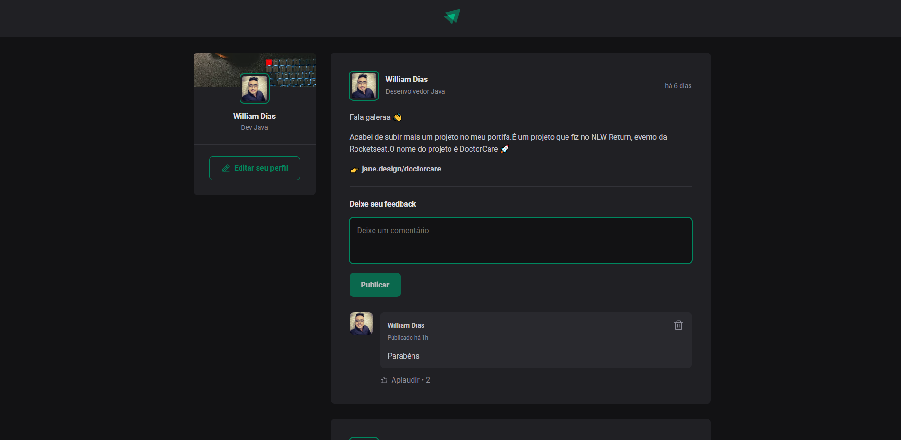

<h1 align="center">
    IgniteFeed
</h1>

<h4 align="center">
  ☕ Projeto desenvolvido durante o treinamento de React do Ignite da Rocketseat
</h4>

 

  

## 💻 Projeto
O IgniteFeed é um projeto desenvolvido durante o treinamento de ReactJS da Rocketseat, onde abordamos os principais conceitos envolvidos dentro da biblioteca React.

## :rocket: Tecnologias

Tecnologias utilizadas no projeto:

- [React](https://reactjs.org)

## 🚀 Instalação do Frontend
1. Faça o download do projeto
2. Com o terminal aberto na pasta do projeto, rode o comando `yarn` para instalar todas as dependências necessárias
3. Rode o comando yarn vite para rodar o projeto, após isso abre o navegador e digite o endereço http://localhost:3000/

## 🤔 Como contribuir

- Faça um fork desse repositório;
- Cria uma branch com a sua feature: `git checkout -b minha-feature`;
- Faça commit das suas alterações: `git commit -m 'feat: Minha nova feature'`;
- Faça push para a sua branch: `git push origin minha-feature`.

Depois que o merge da sua pull request for feito, você pode deletar a sua branch.

---

Desenvolvido por [William José Dias!](https://github.com/WilliamWJD)